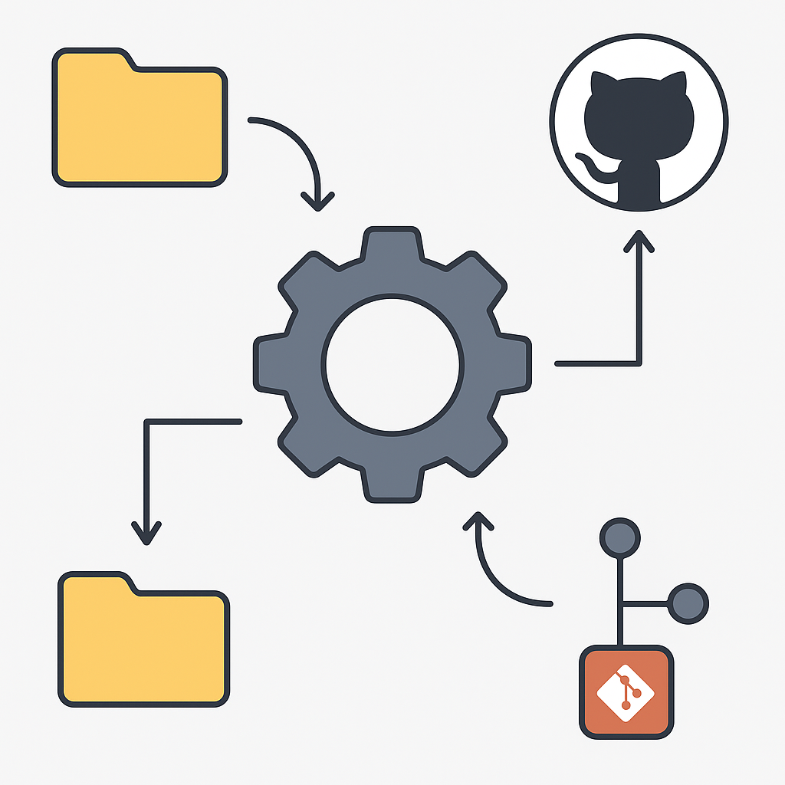

# 🚀 Git - Automations 

  
    

  
  

---
# Git Automation Tool

## English

### Overview
This tool automates the process of initializing Git repositories for multiple projects in a parent directory, creating corresponding repositories on GitHub, and pushing the projects with proper configuration. It supports batch processing of multiple projects at once, handling Git configuration such as user name, email, remote URLs, and branch management.

### Features
- Scan a parent directory containing multiple project folders.
- Automatically create GitHub repositories matching project names.
- Initialize local Git repositories and configure user info.
- Add, commit, and push code to GitHub.
- Support for HTTPS and SSH protocols.
- Branch management (create, rename, switch).
- Detailed logging of operations and errors.

### Requirements
- Python 3.7+
- PyGithub library (`pip install PyGithub`)
- Git installed and available in system PATH.
- A GitHub Personal Access Token with repo permissions.

### Usage
1. Prepare a directory containing all your project folders.
2. Generate a GitHub Personal Access Token.
3. Run the tool specifying the parent directory and your GitHub credentials.
4. The tool will process each project folder, create corresponding GitHub repos, and push the code.

### Future Plans
- Add authentication UI to handle GitHub OAuth login.
- Support for private and public repo settings.
- Enhanced branch operations and conflict resolution.
- Integration with CI/CD pipelines.
- More detailed real-time progress reporting.

---

## فارسی

### معرفی
این ابزار فرآیند ساخت مخازن Git برای چند پروژه داخل یک دایرکتوری مادر را اتوماتیک می‌کند، ریپازیتوری‌های متناظر را در GitHub ایجاد می‌کند، و پروژه‌ها را با تنظیمات مناسب به آن‌ها ارسال می‌کند. امکان پردازش دسته‌ای چند پروژه به صورت همزمان وجود دارد و تنظیماتی مانند نام کاربر، ایمیل، آدرس ریموت و مدیریت شاخه‌ها را انجام می‌دهد.

### امکانات
- اسکن دایرکتوری مادر حاوی چند پروژه.
- ساخت خودکار مخزن GitHub با نام پروژه‌ها.
- مقداردهی اولیه مخزن محلی و تنظیم اطلاعات کاربری.
- اضافه کردن، کمیت کردن و پوش کردن کد به GitHub.
- پشتیبانی از پروتکل‌های HTTPS و SSH.
- مدیریت شاخه‌ها (ساخت، تغییر نام، تعویض).
- لاگ‌گیری دقیق از عملیات و خطاها.

### پیش‌نیازها
- پایتون نسخه ۳.۷ به بالا
- کتابخانه PyGithub (`pip install PyGithub`)
- نصب بودن Git در سیستم
- توکن دسترسی شخصی GitHub با دسترسی به مخازن

### نحوه استفاده
1. یک دایرکتوری مادر حاوی پروژه‌های خود آماده کنید.
2. توکن دسترسی شخصی GitHub بسازید.
3. ابزار را با تعیین دایرکتوری و مشخصات GitHub اجرا کنید.
4. ابزار هر پروژه را پردازش کرده، مخزن GitHub ایجاد می‌کند و کد را ارسال می‌کند.

### چشم‌انداز آینده
- افزودن رابط کاربری برای احراز هویت OAuth گیت‌هاب.
- پشتیبانی از تنظیمات مخزن خصوصی و عمومی.
- بهبود عملیات شاخه‌ها و مدیریت تعارض‌ها.
- ادغام با سیستم‌های CI/CD.
- گزارش‌دهی پیشرفت به صورت لحظه‌ای و دقیق‌تر.

